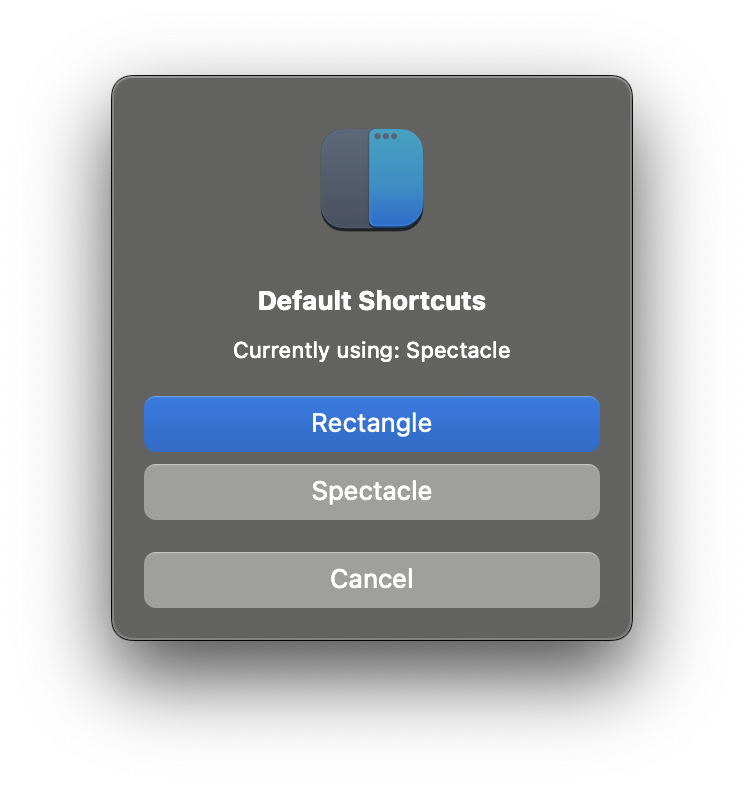

# MAC OS

## macOS settings

Run `sh mac_os/setup.sh` for specific my custom _System Preferences_ setup. Edit the file as you may please before running.

## App store apps

Apps from App store that I use can be found in [appstore.md](/mac_os/appstore.md).

## Brew

I have 3 Brewfiles in the `./mac_os` folder, in order of how elaborate the list is, starting with the least elaborate:

(The command to install using a specific Brewfile is in **brackets**)

- Brewfile (`brew bundle --file mac_os/work.Brewfile`)
- work.Brewfile (`brew bundle --file mac_os/work.Brewfile`)
- pro.Brewfile (`brew bundle --file mac_os/pro.Brewfile`)

## Specific apps

- [Rectangle](https://rectangleapp.com/) - An app for moving and resizing windows in macOS using keyboard shortcuts or snap areas
- [iTerm](https://iterm2.com/) - A replacement for Terminal

### Rectangle

Once, rectangle is installed, import settings in [`/mac_os/RectangleConfig.json`](/mac_os/RectangleConfig.json).

For context, I've only added these:

**HINT**: <i>Repeatedly using the keyboard shortcuts cycles through the options. For example clicking through `^⌥F` **five** times gets you to **Bottom Center Sixth**.</i>

### iTerm

To sync iTerm settings, open iTerm's **Preferences/General/Preferences**:

1. select the checkbox,
2. navigate to the local repo,
3. then, after _Save Changes_, select **Manually** and exit.
4. Open iTerm once again to see the preferences loaded.

To save any updates to your preferences, open iTerm's **Preferences/General/Preferences** and after _Save Changes_, select **When Quitting**.

Now your changes are tracked in the `com.googlecode.iterm2.plist` file at the root folder.

I prefer having a background image, transparency and blur:

